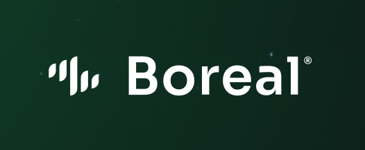

# Documentation Boreal

A **Boreal DeFi**, **Robust** Foundry Project.

**LINK SITE BOREAL:** https://8c81-2804-1e78-1102-bb0-7188-1a40-d0a7-c055.ngrok-free.app  

### Boreal is a DeFi platform with a bridge between a Private Blockchain (Hyperledger Besu) and public blockchains, especially Lachain and Ethereum. Our main services include staking and liquidity pools on Lido Finance with DREX (Tokenized Real). Furthermore, we have our own manually created contract that takes into account the protocols of Lido Finance and Uniswap, allowing for the execution of major operations on both from the same place. The interaction function with the minting of positions in Uniswap V3 includes user-driven tick calculation abstraction, enabling them to choose their position based on the current parity's percentage range. 

**Building & Testing**

- Go to folder smart contracts.

Build the foundry project with `forge build`. Then you can run tests with `forge test -vvvv`.

Deploy the foundry project with `forge script script/Deploy.s.sol:Deploy --rpc-url  https://rpc1.mainnet.lachain.network/ --private-key <private-key> --broadcast --verify -vvvv`. 

The project's focus is to address interoperability between private and public blockchains (Lachain) and to utilize DREX in the decentralized financial system, alongside Lido Finance and to simplify and unify DeFi protocols.


**Addresses deployed and verify on the Goerli**

Verified addresses in Goerli:

- Boreal: [Boreal](https://goerli.etherscan.io/address/0xcd24cddae01e7bb6a48f74ebc3560999f133b2da)

**Addresses deployed Real Tokenizado In various Networks**

- Lachain Mainnet: [Lachain](https://testexplorer.lachain.network/address/0x4Eb845fc5eedcf3f1a7925F47372a3a9aa437adE)

- Goerli: [Goerli](https://goerli.etherscan.io/address/0x438db7329230cCACBb5C02ee5b01b300eb13C633)

- Mumbai: [Munbai](https://mumbai.polygonscan.com/address/0xb50b190efbb7d6913c85c43e461b5bcb964e2b2b#code)


### Below, video of interaction using FireFly running Hyperledger Besu:

- RealTokenizado: [FireFly-Hyperledger](https://youtu.be/BYuuXzXfynQ)

### API:

- API for interaction with the Tokenized Real on the private blockchain : [API-HyperledgerBesu](https://b898-2804-431-cfef-b4b0-5c97-1b98-a113-6321.ngrok-free.app/api/v1/namespaces/default/apis/RealTokenizado/api#/)

### Blueprint

```txt
lib
├─ forge-std — https://github.com/foundry-rs/forge-std
├─ solmate — https://github.com/transmissions11/solmate
scripts
├─ Deploy.s.sol — Example Contract Deployment Script
src
├─ Boreal — Main DeFi contract involving liquidity pool and using the Lido and Uniswap protocol.
├─ ./Utils — Folder containing UniswapV3Liquidity build positions in the protocols.
├─ ./Interfaces — Folder containing interface contracts for interaction with the protocols.
balances and generating the score
test
└─ Counter.t — BorealTest 
```


### Notable Mentions

- [femplate](https://github.com/refcell/femplate)
- [foundry](https://github.com/foundry-rs/foundry)
- [solmate](https://github.com/Rari-Capital/solmate)
- [forge-std](https://github.com/brockelmore/forge-std)
- [forge-template](https://github.com/foundry-rs/forge-template)
- [foundry-toolchain](https://github.com/foundry-rs/foundry-toolchain)


### Disclaimer

_These smart contracts are being provided as is. No guarantee, representation or warranty is being made, express or implied, as to the safety or correctness of the user interface or the smart contracts. They have not been audited and as such there can be no assurance they will work as intended, and users may experience delays, failures, errors, omissions, loss of transmitted information or loss of funds. The creators are not liable for any of the foregoing. Users should proceed with caution and use at their own risk._

See [LICENSE](./LICENSE) for more details.
